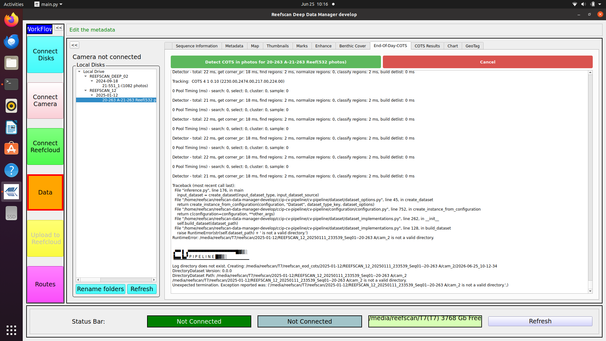
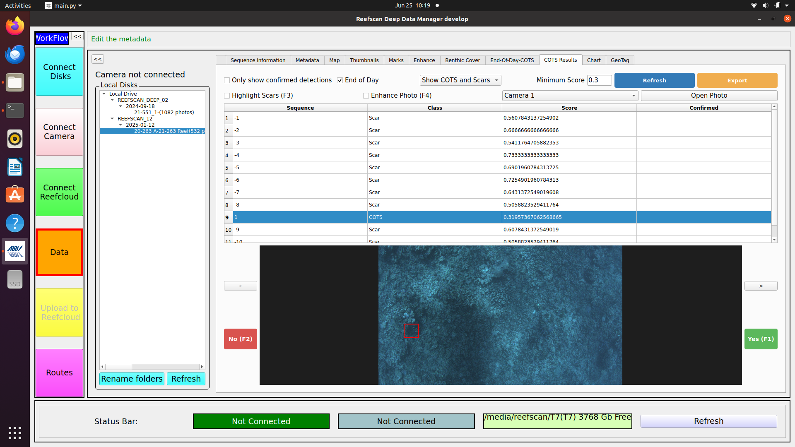
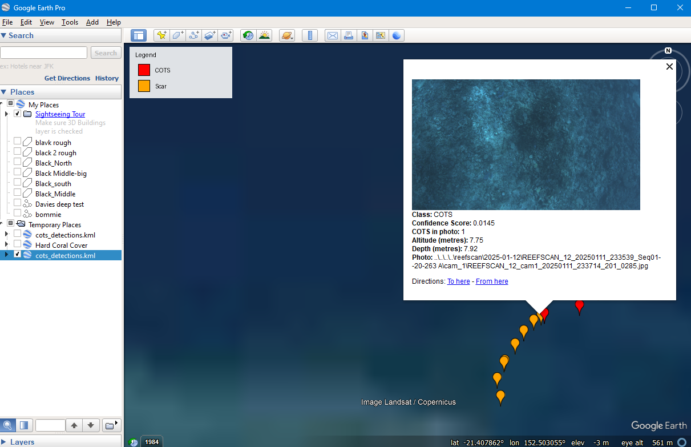
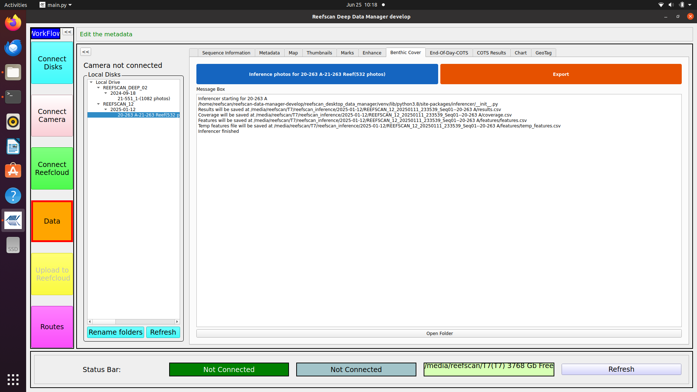
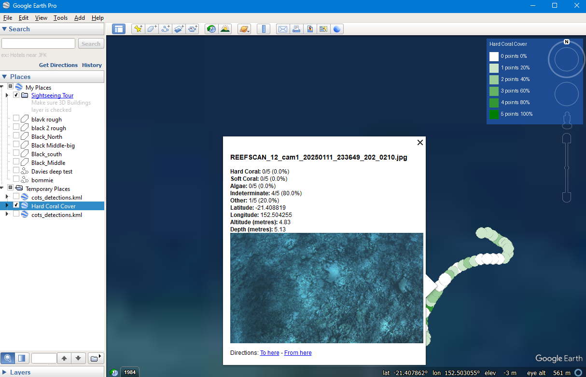

# ReefScan Deep — CCIP End-of-Day Processing Guide

This guide covers installation, COTS detection review, and benthic cover inference for the ReefScan Deep system.

---

## Installation

1. Copy the tar file and `install.sh` to the home folder.
2. Ensure you have an internet connection.
3. Open a terminal and run:

```bash
cd
bash reefscan_install.sh <version>
```

This will install the software and add shortcuts to the desktop.

### Verify installation

1. Launch **reefscan-deep.sh** from the desktop.
   - If the shortcut is not present, re-run the install script above.
2. Connect the disks with downloaded ReefScan data.
3. Click **Connect Disks**.
4. Choose **data** on the left.
5. Select a sequence of interest.
6. Choose **End-of-Day-COTS** at the top.
   - If the tab is not available, re-run the install script.

---

## End-of-Day Workflow

1. Launch **reefscan-deep.sh** from the desktop.
2. Connect the disks with downloaded ReefScan data.
3. Click **Connect Disks**.
4. Choose **data** on the left.
5. Select the sequence of interest.
6. Choose the **End-of-Day-COTS** tab at the top.
7. Press **Detect COTS** and wait for it to complete (see [COTS Detection](#cots-detection) below).
8. Choose the **COTS Results** tab to review detections (see [COTS Results](#cots-results) below).
9. Choose the **Benthic Cover** tab to run benthic classification (see [Benthic Cover](#benthic-cover) below).

---

## COTS Detection

The **End-of-Day-COTS** tab runs the CCIP segmentation model against all photos for a selected sequence. 
### How it works

Detection runs on both cameras automatically. For each camera the model analyses every photo in the sequence and writes JSON result files to:

```
reefscan_eod_cots/<sequence>/cam_1/
reefscan_eod_cots/<sequence>/cam_2/
```

When detection finishes, the results are loaded into memory and are immediately available in the **COTS Results** tab.

### Running detection

1. Select a sequence in the left-hand tree.
2. Choose the **End-of-Day-COTS** tab at the top.
3. Press **Detect COTS**.
   - The output panel shows a live log of the detector progress.
   - Expected processing time: approximately **20 seconds per 100 photos**.
   - Both cameras are processed automatically — there is no need to switch between them.
   - If the process is interrupted, you can check that it completed correctly by checking the [COTS Results](#cots-results) tab.
4. Press **Cancel** at any time to stop the process.



When detection is complete, choose the **COTS Results** tab to review detections.

> **Tip:** Detection can also run automatically during a download. In the download panel, tick **Find COTS** before pressing **Download** and detection will run on all downloaded sequences without a separate step.

---

## COTS Results



The COTS Results screen displays every photo sequence in which the model detected at least one COTS or scar. Each row in the table represents one detection and shows:

| Column | Description |
|--------|-------------|
| Sequence | Unique ID for this detection sequence |
| Class | `COTS` or `Scars` |
| Score | Model confidence (0-1). Higher is more confident. |
| Confirmed | `Yes` / `No` / blank (not yet reviewed) |

Clicking a row loads the corresponding photos in the panel on the right. If there are multiple photos for a detection, use **Next** and **Previous** to step through them. The detected object is highlighted with a coloured bounding box:

- **Red** — the COTS for the currently selected sequence
- **Yellow** — other COTS detections present in the same photo
- **Green** — the current selection, after it has been confirmed as real

### Filter controls

Set these controls before pressing **Refresh** to update the table:

| Control | Purpose |
|---------|---------|
| **End of Day** checkbox | Use the end-of-day model results instead of realtime results |
| **Filter** drop-down | Choose *Show COTS and Scars*, *Show COTS*, or *Show Scars* |
| **Minimum Score** text box | Only show detections above this confidence threshold (default: `0.78`). Lower to see more candidates; raise to see only high-confidence detections. |
| **Camera** drop-down | Select *Camera 1* or *Camera 2*. Review each camera separately. |
| **Only Confirmed** checkbox | Hide detections not yet confirmed as real. Useful for a second-pass review or export. |
| **Highlight Scars** checkbox (F3) | Overlay the scar mask on the photo to make scars easier to see. |
| **Enhance** checkbox (F4) | Apply contrast enhancement to improve visibility in dark images. |

Press **Refresh** after changing any filter to reload the table.

### Reviewing detections — recommended workflow

**Camera 1:**

1. Tick **End of Day**.
2. Set **Filter** to *Show COTS*.
3. Set **Minimum Score** to `0.78`.
4. Select **Camera 1**.
5. Press **Refresh**.
6. For each row in the table:
   - Click the row to load the photo(s).
   - Step through photos with **Next** / **Previous** if there are multiple.
   - Press **Yes** (or **F1**) if a real COTS is visible — the bounding box turns green and the detection is saved as confirmed.
   - Press **No** (or **F2**) if it is a false alarm — recorded as denied.
7. Repeat with **Filter** set to *Show Scars* if scar data is needed.

**Camera 2:**

8. Change **Camera** to *Camera 2* and press **Refresh**.
9. Repeat the review steps above.

### Exporting results

Once review is complete, press **Export** to save the results. A folder chooser dialog opens, pre-populated with a suggested output path:

```
<survey_drive>/reefscan_results/cots_detections/
```

Three files are written to the chosen folder:

#### `cots_detections.kml`



A KML file for use in Google Earth. Each detection appears as a coloured map pin:

- **Red pin** — COTS detection
- **Orange pin** — Scar detection

Clicking a pin opens a balloon showing:
- Thumbnail of the best (highest-score) photo for that detection
- Class, confidence score, number of COTS in the photo (matching the active filter), altitude (metres), and depth (metres)
- Relative path to the photo file

A legend is pinned to the top-left corner of the map.

#### `cots_detections.csv`

A spreadsheet-friendly summary with one row per detection:

| Column | Description |
|--------|-------------|
| `image_name` | Filename of the highest-score photo for this detection |
| `timestamp` | ISO 8601 local timestamp of the photo |
| `image_path` | Relative path to the highest-score photo |
| `latitude` | Decimal degrees |
| `longitude` | Decimal degrees |
| `altitude_metres` | Distance from camera to seabed |
| `depth_metres` | Total water depth |
| `sequence_id` | Detection sequence ID |
| `class` | `COTS` or `Scars` |
| `confidence_score` | Model confidence (0–1) |
| `cots_in_photo` | Count of detections in the same photo that pass the active filter |
| `confirmed` | `Yes`, `No`, or `Unassessed` |

#### `export_parameters.yaml`

Records the filter settings used at export time so results can be reproduced:

```yaml
eod: true
only_show_confirmed: false
camera: cam_1
minimum_score: 0.78
by_class: COTS
```

After export the output folder opens automatically in the file manager.

---

## Benthic Cover

The Benthic Cover tab runs an AI model that classifies the coral and substrate visible in each photo. It is separate from the COTS detection workflow and can be run independently.



### How it works

The model assigns **5 annotation points** to each photo and predicts the benthic category at each point (e.g. Hard Coral, Soft Coral, Algae, Sand, Unknown). The proportion of Hard Coral points across all photos gives the benthic cover estimate for the sequence.

Photos are first sub-sampled to a `reefscan_reefcloud/` folder. It attempts to remove overlapping photos. Inference is run on that sub-sample. This keeps processing time manageable and matches the spatial density expected by the model.

### Running inference

1. Select a sequence in the left-hand tree.
2. Choose the **Benthic Cover** tab at the top.
3. Press **Inference Photos**.
   - A progress bar shows `Inferencing: X / Y points done`.
   - Expected processing time: approximately **10 seconds per 100 photos**.


### Exporting results

Press **Export** to produce files suitable for sharing and use in Google Earth. A folder chooser opens, pre-populated with a suggested output path:

```
<survey_drive>/reefscan_results/benthic_cover/
```

Three files are written to the chosen folder:

#### `benthic_cover.kml`



A KML file for use in Google Earth. Each photo with exactly 5 annotation points appears as a **coloured circle** on the map. The colour indicates Hard Coral coverage for that photo:

| Colour | Hard Coral points | Coverage |
|--------|------------------|----------|
| White | 0 / 5 | 0% |
| Very light green | 1 / 5 | 20% |
| Light green | 2 / 5 | 40% |
| Medium green | 3 / 5 | 60% |
| Green | 4 / 5 | 80% |
| Dark green | 5 / 5 | 100% |

Clicking a circle opens a balloon showing:
- Point count and percentage for each benthic group (e.g. `Hard Coral: 3/5 (60%)`, `Soft Coral: 1/5 (20%)`, …)
- Latitude and longitude
- Altitude (metres) and depth (metres)
- A thumbnail of the photo

A legend is pinned to the top-right corner of the map.

#### `benthic_points.csv`

One row per annotation point (5 rows per photo):

| Column | Description |
|--------|-------------|
| `image_name` | Filename of the photo |
| `timestamp` | ISO 8601 local timestamp of the photo |
| `image_path` | Relative path to the source photo |
| `point_num` | Point index within the photo (1–5) |
| `point_coordinate` | Pixel coordinate of the annotation point |
| `latitude` | Decimal degrees |
| `longitude` | Decimal degrees |
| `altitude_metres` | Distance from camera to seabed |
| `depth_metres` | Total water depth |
| `pred_class` | Predicted fine-grained class label |
| `pred_desc` | Human-readable description of the class |
| `pred_group` | Broad group: `Hard Coral`, `Soft Coral`, `Algae`, `Indeterminate`, `Other`, etc. |

#### `benthic_cover.csv`

A per-image summary table (one row per photo with exactly 5 annotation points):

| Column | Description |
|--------|-------------|
| `image_name` | Filename of the photo |
| `timestamp` | ISO 8601 local timestamp of the photo |
| `image_path` | Relative path to the photo |
| `latitude` | Decimal degrees |
| `longitude` | Decimal degrees |
| `altitude_metres` | Distance from camera to seabed |
| `depth_metres` | Total water depth |
| `num_hard_coral` | Hard Coral annotation points (0–5) |
| `num_soft_coral` | Soft Coral annotation points (0–5) |
| `num_algae` | Algae annotation points (0–5) |
| `num_indeterminate` | Indeterminate annotation points (0–5) |
| `num_other` | All other categories combined (0–5) |
| `num_total_points` | Total points for this photo (always 5) |
| `perc_hard_coral` | Hard Coral percentage (0–100) |
| `perc_soft_coral` | Soft Coral percentage (0–100) |
| `perc_algae` | Algae percentage (0–100) |
| `perc_indeterminate` | Indeterminate percentage (0–100) |
| `perc_other` | Other percentage (0–100) |

#### `track_benthic_cover.csv`

A track-level summary of benthic cover across all photos in the sequence. This is a copy of the model's internal `coverage.csv` and contains one row per benthic group with aggregate point counts and percentages.

After export the output folder opens automatically in the file manager.
